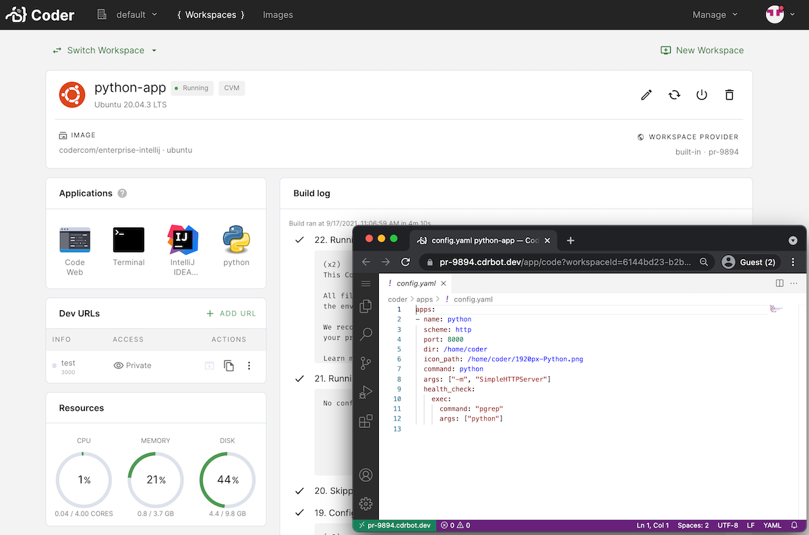

You can connect to web applications installed on your workspace using the
applications specification file located at `/coder/apps/config.yaml` of the
workspace filesystem.



## Enabling custom apps

If you'd like to use custom apps in Coder, you can enable this feature in the
UI:

1. In the top-right, click on your avatar and select **Feature Preview**
1. Click **Generic applications** and select **Enable**.

## Application specification file

The application specification file allows you to define what Coder needs to
launch the application. Within the file, you can specify the following for each
application:

```yaml
# /coder/apps/config.yaml

apps:
    # Name of application in launcher
  - name: projector
    # Application scheme - must be http or https
    scheme: http
    # Application port
    port: 9999
    # Working directory
    working-directory: /home/coder
    # File path to icon used in application launcher
    icon-path: /home/coder/goland.svg
    # Command to start the application
    command: /home/coder/.local/bin/projector
    # Array of arguments for command
    args: ["run"]
    # Health checks to get running application status
    # Can use exec or http health checks to localhost
    health-check:
      exec:
        command: "pgrep"
        args: ["projector"]
      http:
        scheme: "http"
        path: "/"
        port: 9999
```

**Notes**:

- All top-level fields in the `config.yaml` file are required
- You must include at least one health check. The `exec` health check looks for
  an exit code of `0`, while the `http` health check looks for the return of
  `HTTP 200`.

You can include the applications specification file in your
[workspace image](../images/writing.md). You an also modify the file via
[personalization](./personalization.md) scripts.
